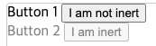
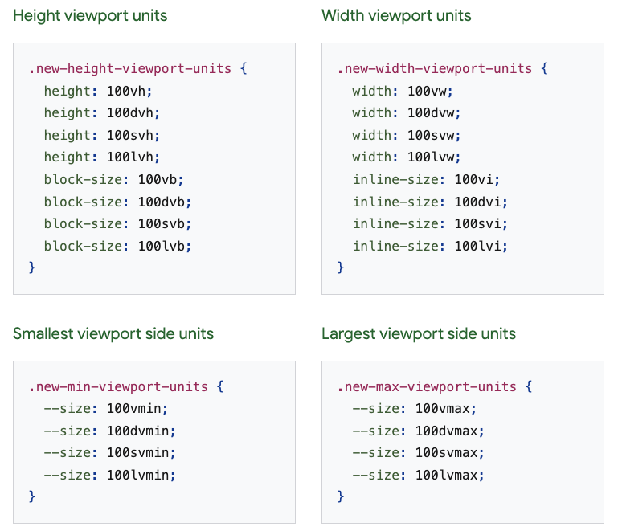

# CSS

## CSS: Cascading Style Sheets
  - HTML이나 XML(XML의 방언인 SVG, XHTML 포함)로 작성된 문서의 표시 방법을 기술하기 위한 스타일 시트 언어
  - 요소가 화면, 종이, 음성이나 다른 매체 상에 어떻게 렌더링되어야 하는지 지정

- [CSS1](https://www.w3.org/TR/CSS1/)
  - 1996.12. CSS1 권고안 발표
  - 2008.04. 개정안 발표
- [CSS2.1](https://www.w3.org/TR/CSS2/)
  - 1998.05. CSS2 권고안 발표
  - 2011.06. CSS2.1 권고안 발표
  - 2016.04. 2021.12. 두 차례에 걸쳐 수정
- [CSS3](https://www.w3.org/TR/css3-roadmap/)
  - 2005.12.05. 이후 개발중
  - 아직 권고안에 이른 모듈이 없음.
- [Latest version of CSS](https://www.w3.org/TR/CSS/)
- [CSS current work](https://www.w3.org/Style/CSS/current-work)

## CSS Syntax


- Selector: 스타일을 지정할 HTML 요소를 선택.
- Declaration: CSS 속성과 값을 포함.
  ```
  {CSS property}: {value};
  ```
- Declaration Block: 하나 이상의 선언을 포함하는 선언 블럭.

## CSS 사용법

1. External CSS

    ```html
    ...
    <head>
    <link rel="stylesheet" href="mystyle.css">
    </head>
    ...
    ```

2. Internal CSS

    ```html
    ...
    <head>
    <style>
      h1 {
        color: red;
        text-align: center;
      }
    </style>
    </head>
    ...
    ```

3. Inline CSS

    ```html
    ...
    <body>
      <h1 style="color:red;text-align: center;">Heading</h1>
    </body>
    ...
    ```

## [State of CSS 2022](https://web.dev/state-of-css-2022/)

  *[Google I/O 2022](https://io.google/2022/intl/ko/)*

### [Fresh for 2022](https://web.dev/state-of-css-2022/#fresh-for-2022)

---

#### 1. [Cascade layers](https://web.dev/state-of-css-2022/#cascade-layers)

- Before `@layer`
  - 마지막에 선언된 스타일이 이전에 선언된 스타일을 덮어쓰게 됨.
  - 개발자가 스타일이 로드되는 순서를 신경쓰고 관리해야 했음.

- After `@layer`
  - 레이어와 순서를 미리 정의할 수 있음.
  - 스타일이 로드되거나 정의될 때 레이어 내에 배치되므로 관리 리소스를 줄일 수 있음.

  **before @layer**

  ```css
  /* index.css */
  @import "reset.css";
  @import "normalize.css";

  @import "vars.css";

  @import "layouts.css";

  @import "component-1.css";
  @import "component-2.css";
  @import "component-3.css";
  ```

  **after @layer**

  ```css
  /* index.css */
  @layer base, layouts, components;

  @import url("reset.css")       layer;
  @import url("component-1.css") layer(components);
  @import url("vars.css")        layer(base);
  @import url("component-2.css") layer(components);
  @import url("normalize.css")   layer;
  @import url("layouts.css")     layer(layouts);
  @import url("component-3.css") layer(components);
  
  ...

  @layer layouts {
    padding: 16px;

    @layer components {
      h2 {
        text-align: center;
      }
    }
  }
  ```

#### 2. [Subgrid](https://web.dev/state-of-css-2022/#subgrid)

- Before `subgrid`
  - grid 중첩 시 상위 grid의 grid line을 사용 불가능.

- After `subgrid`
  - 상위 grid의 row나 column 사용 가능.

  ```css
  .grid {
    display: grid;
    grid-template-columns:
      [fullbleed-start]
      auto [main-start] min(90%, 60ch) [main-end] auto
      [fullbleed-end]
    ;
  }

  .grid > * {
    display: grid;
    grid-template-columns: subgrid;
  }

  .main-content {
    grid-column: main;
  }

  .fullbleed {
    grid-column: fullbleed;
  }
  ```

  ```html
  <div class="grid">
    <main class="main-content">
      ...
    </main>
    <div class="fullbleed">
      ...
    </div>
  </div>
  ```

#### 3. [Container queries](https://developer.mozilla.org/en-US/docs/Web/CSS/CSS_Container_Queries)

- Before `@container`
  - 요소가 전체 뷰포트의 크기에만 반응

- After `@container`
  - 요소가 상위 컨테이너의 크기 또는 스타일에반응

  ```css
  @container sidebar (min-width: 400px){
    .card {
      display: grid;
      grid-template-columns: 2fr 1fr;
    }
  }
  ```

#### 4. [accent-color](https://web.dev/state-of-css-2022/#accent-color)

- Before `accent-color`
  - 일관성 있는 브랜드 색상을 위해 복잡한 CSS 라이브러리나 솔루션을 사용해야 했음.

- After `accent-color`
  - 내장된 컴포넌트의 브랜드 색상을 가져옴.
  - light theme, dark theme에 대응.

  ```css
  :root {
    accent-color: hotpink;
  }

  @media (prefers-color-scheme: dark) {
    :root {
      accent-color: lightpink;
    }
  }

  progress {
    accent-color: indigo;
  }
  ```

#### 5. [Color level 4 and 5](https://web.dev/state-of-css-2022/#color-level-4-and-5)

- Before
  - 디자인 시스템은 적절한 대비 색상을 미리 계산하고 팔레트를 보장해야 했음.
  - 전처리기 또는 JavaScript가 무거운 작업을 수행하는 동안 이 모든 작업을 수행.

- After
  - 브라우저와 CSS는 모든 작업을 동적으로 적절하게 수행 가능해짐.
  - 테마 및 데이터 시각화 색상을 활성화하기 위해 사용자에게 용량이 큰 CSS 및 JavaScript를 보내는 대신 CSS는 오케스트레이션 및 계산을 수행 가능.
  - 사용되기 전에 support 확인이나 fallback의 처리가 향상됨.

**[hwb()](https://web.dev/state-of-css-2022/#hwb)**

  *[hwb() color palette DEMO](https://codepen.io/web-dot-dev/pen/qBpzwZW)*

- hue, whiteness, and blackness
- RGB 대체 가능

  ```css
  :root {
    --hwb-swatch-1: hwb(200 75% 0%);
    --hwb-swatch-2: hwb(200 50% 25%);
    --hwb-swatch-3: hwb(200 25% 50%);
    --hwb-swatch-4: hwb(200 0% 75%);
    --hwb-swatch-5: hwb(200 0% 90%);
  }
  ```

**[color-mix()](https://web.dev/state-of-css-2022/#color-mix)**

  *[color-mix() theming DEMO](https://codepen.io/argyleink/pen/WNoWadG)*

- 색상 혼합

  ```css
  .color-mix-example {
    --brand: #0af;

    --darker: color-mix(var(--brand) 25%, black);
    --lighter: color-mix(var(--brand) 25%, white);
  }

  .color-mix-example2 {
    --brand: #0af;

    --darker: color-mix(in srgb, var(--brand) 25%, black);
    --lighter: color-mix(in srgb, var(--brand) 25%, white);
  }
  ```

**[color-contrast()](https://web.dev/state-of-css-2022/#color-contrast)**

  *[color-contrast() DEMO](https://codepen.io/web-dot-dev/pen/qBpzwZW)*

- 대비 색상 계산

  

  ```css
  .swatch {
    background: var(--_swatch-bg);
    display: grid;
    place-content: center;
    color: color-contrast(var(--_swatch-bg) vs black, white);
  }
  ```

**[Relative color syntax](https://web.dev/state-of-css-2022/#relative-color-syntax)**

**[Gradient color spaces](https://web.dev/state-of-css-2022/#gradient-color-spaces)**

#### 6. [inert](https://web.dev/state-of-css-2022/#inert)

- Before `inert`
  - 사용자의 주목이 필요한 영역에 focus를 주는 게 일반적인 방법. (trapping)

- After `inert`
  - trapping이 필요하지 않음.

  ```html
  <div>
    <label for="button1">Button 1</label>
    <button id="button1">I am not inert</button>
  </div>
  <div inert>
    <label for="button2">Button 2</label>
    <button id="button2">I am inert</button>
  </div>
  ```

  ```css
  [inert] > * {
    opacity: .5;
  }
  ```

  

#### 7. [COLRv1 Fonts](https://web.dev/state-of-css-2022/#colrv1-fonts)

#### 8. [Viewport units](https://web.dev/state-of-css-2022/#viewport-units)

- Before `new viewport variants`
  - vh, vw, vmin, vmax 등 물리적 단위 제공
  - 모바일에서는 페이지 로드 중에 상태표시줄이 표시되었다가 사라지는 등 동작이 존재.
  - 상태표시줄의 여부에 따라 vh 단위가 달라지고 불안정한 레이아웃 전환이 생길 수 있음.
  - vh는 항상 가장 큰 뷰포트를 의미했음.

- After `new viewport variants`
  - logical equivalents가 추가되어 소형, 대형 및 동적 뷰포트 단위 사용 가능.
  - 여러 단위 중에 어떤 것을 사용할 지 선택 가능.
    - dvh(dynamic viewport height)
    - lvh(largest viewport height)
    - svh(smallest viewport height)
  
  

  

#### 9. [:has()](https://web.dev/state-of-css-2022/#has)

- Before `:has()`
  - selector의 'subject'가 맨 뒤에 존재
    
    ```css
    ul > li {   /* li가 subject */
      ...
    }
    ```

- After `:has()`
  - selector의의 'subject'가 앞에 올 수 있음

    ```css
    ul:has(> li) {  /* ul이 subject */
      ...
    }
    ```

- safe to use :has()
  ```css
  @supports (selector(:has(works))) {
    /* safe to use :has() */
  }
  ```

### [2022 and beyond](https://web.dev/state-of-css-2022/#2022-and-beyond)

---

1. [Loosely typed custom properties](https://web.dev/state-of-css-2022/#loosely-typed-custom-properties)
2. [Was in min-width or max-width](https://web.dev/state-of-css-2022/#was-in-min-width-or-max-width)
3. [No media query variables](https://web.dev/state-of-css-2022/#no-media-query-variables)
4. [Nesting selectors is so nice](https://web.dev/state-of-css-2022/#nesting-selectors-is-so-nice)
5. [Scoping styles is really hard](https://web.dev/state-of-css-2022/#scoping-styles-is-really-hard)
6. [No CSS way for a masonry layout](https://web.dev/state-of-css-2022/#no-css-way-for-a-masonry-layout)
7. [CSS can't help users reduce data](https://web.dev/state-of-css-2022/#css-cant-help-users-reduce-data)
8. [Scroll snap features are too limited](https://web.dev/state-of-css-2022/#scroll-snap-features-are-too-limited)
9. [Cycling between known states](https://web.dev/state-of-css-2022/#cycling-between-known-states)
10. [Customizing select elements](https://web.dev/state-of-css-2022/#customizing-select-elements)
11. [Anchoring an element to another](https://web.dev/state-of-css-2022/#anchoring-an-element-to-another)