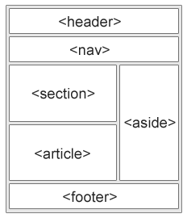
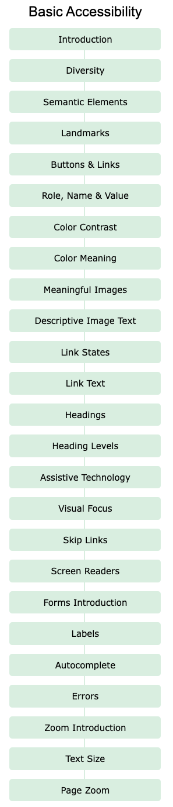
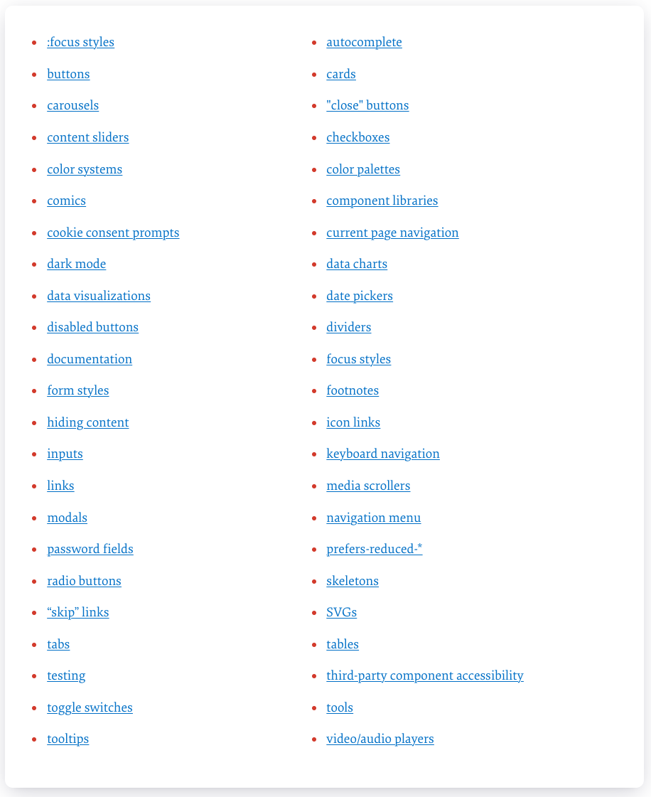
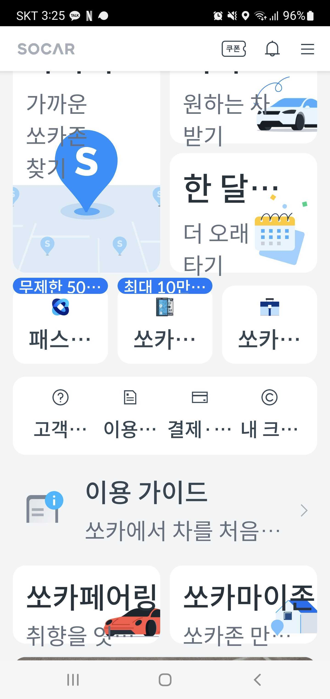
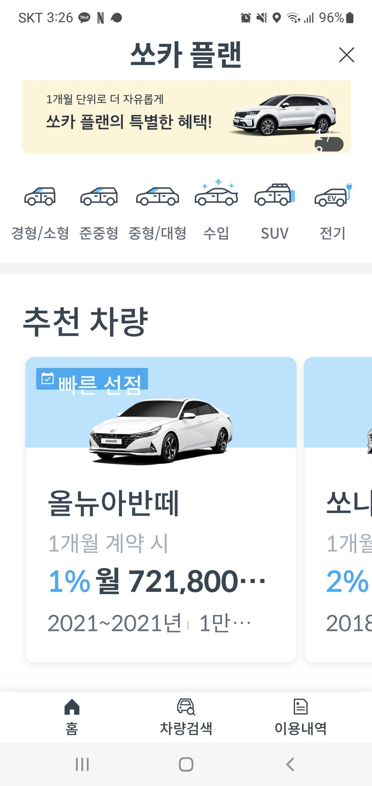
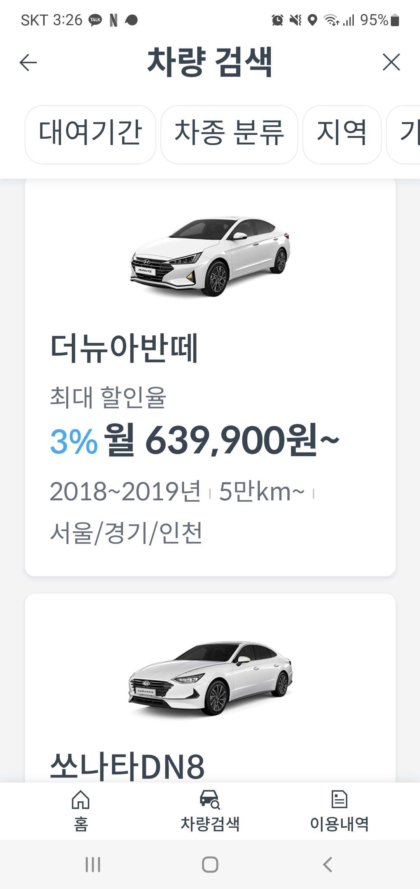
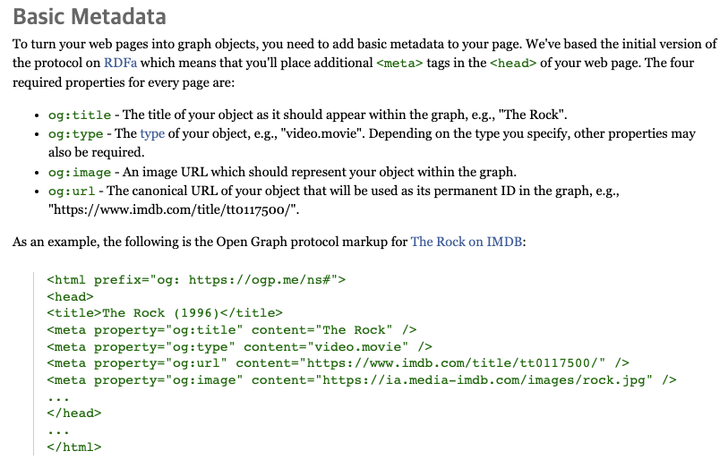
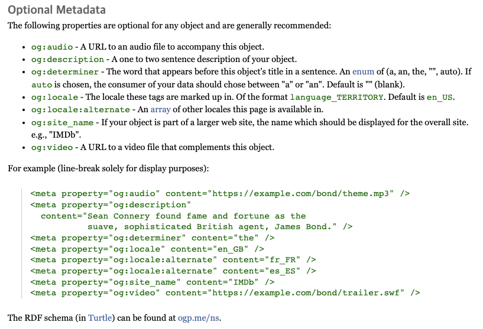

# HTML

## [HTML?](https://www.w3schools.com/html/html_intro.asp)

- HTML: Hyper Text Markup Language
  
  - 웹을 이루는 가장 기초적인 구성 요소로, 웹 콘텐츠의 의미와 구조를 정의할 때 사용
  
  - [Hypertext](https://ko.wikipedia.org/wiki/%ED%95%98%EC%9D%B4%ED%8D%BC%ED%85%8D%EC%8A%A4%ED%8A%B8): 참조(하이퍼링크)를 통해 독자가 한 문서에서 다른 문서로 즉시 접근할 수 있는 텍스트
  
  - [Markup Language](https://ko.wikipedia.org/wiki/%EB%A7%88%ED%81%AC%EC%97%85_%EC%96%B8%EC%96%B4): 태그 등을 이용하여 문서나 데이터의 구조를 명기하는 언어


## [Semantic HTML](https://www.w3schools.com/html/html5_semantic_elements.asp)

### Semantic Elements

- non-semantic Elements: 태그를 보고 컨텐츠 유추가 어려움
  
  - `<div>`, `<span>`, ...

- semantic Elements: 태그를 보고 컨텐츠 유추 가능
  
  - `<article>`, `<aside>`, `<details>`, `<figcaption>`, `<figure>`, `<footer>`, `<header>`, `<main>`, `<mark>`, `<nav>`, `<summary>`, `<time>`, ...

    

## [HTML Best Parctices](https://github.com/hail2u/html-best-practices)

- `&`, `<`, `>`, `"`, `'` 를 제외하고는 문자를 직접 사용해도 됨
  
  - character reference

    | character | reference | description             |
    |-----------|-----------|-------------------------|
    | &         | `&amp;`   | ampersand               |
    | <         | `&lt;`    | less than               |
    | >         | `&gt;`    | greater than            |
    | "         | `&quot;`  | double quote            |
    | '         | `&apos;`  | apostrophe/single quote |

    _참고: [Table Genarator](https://www.tablesgenerator.com/markdown_tables#)_

- SVG는 HTML 문서에서 직접 사용 가능
  
  - Bad

    ```
    <svg xmlns="http://www.w3.org/2000/svg">
      ...
    </svg>
    ```
  
  - Good

    ```
    <svg>
      ...
    </svg>
    ```
  
- 태그의 default role 을 사용하자
  
  - Bad
  
    ```
    <nav role="navigation">
      ...
    </nav>

    <hr role="separator">
    ```
  
  - Good

    ```
    <nav>
      ...
    </nav>

    <hr>
    ```
  
## [Accessibility](https://www.w3schools.com/accessibility/index.php)

<details>
  <summary>Accessibility Summary</summary>
  <div markdown="1">
    <a href="https://www.w3schools.com/accessibility/index.php">
      <h4>Basic Accessibility</h4>
      
    </a>
    <a href="https://www.smashingmagazine.com/2021/03/complete-guide-accessible-front-end-components/">
      <h4>A Complete Guide To Accessible Front-End Components</h4>
      
    </a>
  </div>
</details>

- [Diversity](https://www.w3schools.com/accessibility/accessibility_diversity.php): 보고 듣고 말하는 능력이나 육체적인 능력, 인지력이 떨어지는 사람들도 웹사이트를 이용하는 데 문제가 없도록 고려하자.

- [Semantic Elements](https://www.w3schools.com/accessibility/accessibility_semantic_elements.php): 적절한 엘리먼트들을 사용해 사이트를 구성해서 사용자가 사이트를 탐색하고 상호작용하기 좋도록 만들자.

- [Visual Focus](https://www.w3schools.com/accessibility/accessibility_visual_focus.php): visual focus는 keyboard focus 또는 tab focus로 불리기도 함. 사용자와 상호작용하는 컴포넌트에 포커스가 가도록 만들어주는 것. (보통 border나 outline을 활용)

- [Text Size](https://www.w3schools.com/accessibility/accessibility_text_size.php): 사용자가 전체 인터페이스가 아닌 텍스트 크기만 확대할 수 있도록 하자.

  _(chrome 브라우저 글꼴 크기 설정: chrome://settings/appearance)_

  - 글꼴 키웠을 때 쏘카 앱 화면

    - 쏘카 앱 메인

      
    
    - 쏘카 플랜 메인

      
    
    - 쏘카 플랜 차량 검색

      

## [SEO](https://developers.google.com/search/docs)

- semantic markup

- title: 웹 페이지의 고유 제목. 검색엔진이 웹페이지를 읽을 때 가장 먼저 읽는 내용

  ```
  <title>title</title>
  ```

- meta: 웹 페이지의 메타 정보. 검색엔진의 검색 결과에 표시됨.

  ```
  <meta name="keywords" content="keyword1, keyword2, ...">
  <meta name="desciription" content="페이지 description">
  ```

- [open graph data](https://ogp.me/): Facebook이 웹 사이트에 더 풍부한 메타 데이터를 제공하기 위해 발명한 메타 데이터 프로토콜. 웹 사이트 공유 시 미리보기에 포함되는 내용.

  - [Basic Metadata](https://ogp.me/#metadata)

    

  - [Optional Metadata](https://ogp.me/#optional)

    

  - 트위터도 [자체 메타데이터](https://developer.twitter.com/en/docs/twitter-for-websites/cards/guides/getting-started)가 존재

    ```
    <meta name="twitter:title" content="Mozilla Developer Network">
    ```
- alt: `` 태그에 alt 속성 사용

  - alt 속성: alternative의 의미로 이미지가 로딩되지 못했을 때 대신 표시되는 텍스트

  - alt 속성을 사용하면 시각장애인용 스크린리더가 사용될 때 이미지 대신 alt 속성 값을 읽어 이미지 파악하는 데에 도움을 줌.

  - 검색엔진이 이미지를 발견하면 alt 속성 안의 텍스트를 통해 인덱싱 작업을 하기 때문에 SEO에 좋음.
